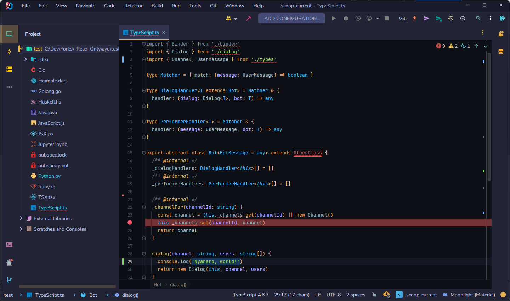

<!-- markdownlint-disable MD026 MD033-->
# ayu Dark for JetBrains

> [ayu](https://github.com/dempfi/ayu) Dark color scheme for **all of your favorite JetBrains IDEs**

> - [Material Theme UI](https://plugins.jetbrains.com/plugin/8006-material-theme-ui)
> Moonlight (w/ custom accent #E6B450)
> - [Atom Material Icons](https://plugins.jetbrains.com/plugin/10044-atom-material-icons)
> - [JetBrains Mono](https://www.jetbrains.com/lp/mono/)

## Feature

While JetBrains IDEs allow for the import and export of color schemes, doing so corrupts some of the color settings for other JetBrains IDEs, so you can't create a single full color scheme file with only that.

So I carefully adjusted the colors in each of the JetBrains IDEs I use and manually merged all of them to make this plugin flawless on multiple IDEs.
That means, You can use "ayu Dark for JetBrains" on all supported JetBrains IDEs with no single missing color!

## Supported IDEs

- IntelliJ IDEA 2022.1.3
- Android Studio 2021.2.1
- PyCharm 2022.1.3
- WebStorm 2022.1.3
- Rider 2022.1.2
- GoLand 2022.1.3

> Custom colors for [Rainbow Brackets](https://plugins.jetbrains.com/plugin/10080-rainbow-brackets) are also available!

## Note

### The colors are different from on ST4 / VSCode / etc.!

ayu for [Sublime Text 4](https://github.com/dempfi/ayu) and for [Visual Studio Code](https://github.com/qyurila/ayu-midas-vscode) have a few of different choices.
One of the biggest difference is the color for numbers.
ayu for ST4 uses #E6B673 while ayu for VSCode uses #D2A6FF.
This plugin follows VSCode one for this aspect, but basically it tries to compromise both schemes as far as possible.

### Contribute

Any suggestion and PRs are welcomed!
If you want to do PR for support new IDEs, please consider to commit exported `.icls` file directly, so that I can review and guide to merge properly.
